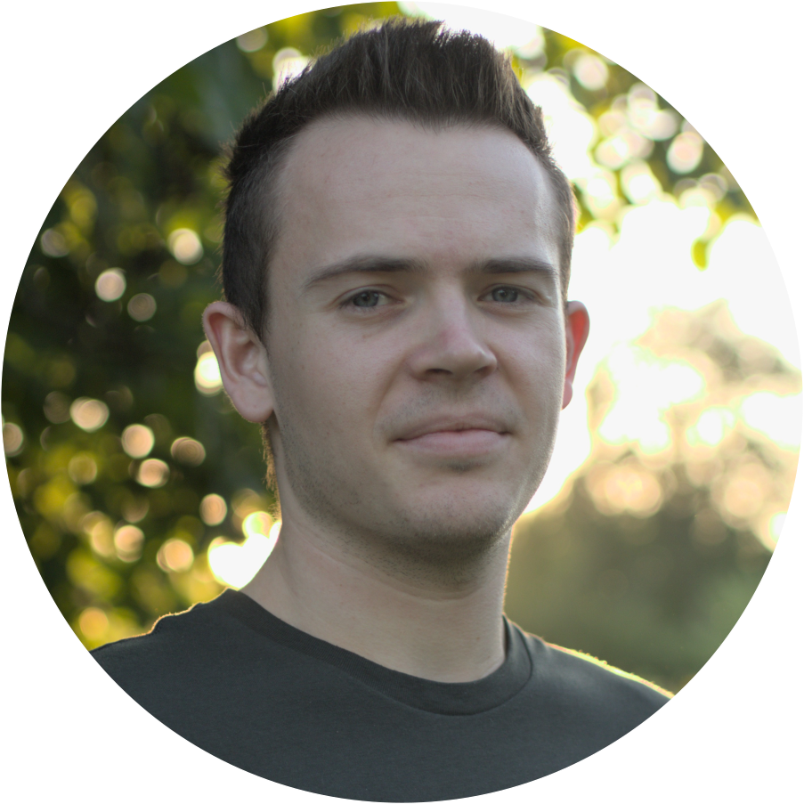

:wave: **Hi, nice to meet you!**
I am currently a masters student in the programs Neurobiology and Evolution &
Ecology at the University of Tuebingen in Germany. I am passionate about 
new, integrative and quantitative approaches in the study of animal behaviours, 
which includes e.g. multi-animal tracking and all things computational. In my spare
time, I try to learn the GNU/Linux operating system or go on photography or scuba-diving 
trips.
 

## Education



I received my B.Sc. in the Animal Evolutionary Ecology group at the University of Tuebingen. 
In my thesis, I used the optokinetic reflex to test, if small, cryptobenthic reef 
fish can use their bright red iris flourescence to increase visual contrast sensitivity.



I am currently starting with my Masters thesis with the Neuroethology group in Tuebingen. 
In my thesis I will record and analyze communication signals of weakly electric fish in their natural habitat
using an electrode grid. This approach is unique in that it allows the tracking of spatiotemporal-
and communication behaviors of multiple individuals simultaneously.




## Other activities
#### :camera: Photography

Ever since childhood, I've been fascinated by photography and pursue this
interest until today. Before starting with my studies, you would find me perched
in a camouflaged tent photographing birds or on mountain-tops at sunrise.
You can find a selection of my creative work [here](https://instagram.com/weygoldtphoto).
 

#### :diving_mask: Scuba diving
During my studies working on visual ecology in marine fish, I also picked up
scuba-diving. I am certified as an Advanced Open Water Diver and would like to
combine this activity with my research in future projects.

#### :penguin: GNU/Linux
After switching to freshwater fish and being overwhelmed by copious amounts of
data that was complicated to analyze, I fell love the GNU/Linux operating system
and would call the practice of learning it a hobby as well. You can find
my personal documentations and configuration files on my [github account](https://github.com/weygoldt).
