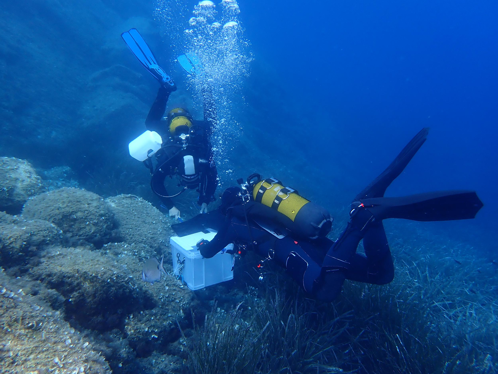

This is a small selection of projects and activities that I currently pursue in
my free time (if there is any).

## Linux and open source software

I am a huge fan of Linux and open source software. I got into Linux when I
started working in the Neuroethology lab at the University of Tuebingen, where
everybody was using it. The idea of a free and open operating system that is
not only highly customizable but also very secure instantly fascinated me.
Linux has been my main operating system for approximately 3 years now. I am
currently running [Arch Linux](https://archlinux.org/) with the [Hyprland
window manager](https://hyprland.org/) on both my personal laptop and work PC.
I keep a [dotfiles repository](github.com/weygoldt/dots) on GitHub where I
store my configuration files and scripts.



## Scuba diving

I am a certified [PADI](https://www.padi.com/) Advanced Open Water Diver.
Diving always fascinated me but doing my Bachelors thesis in a marine biology
lab provided the spark to finally get certified. At this time I have been
diving in Germany, Indonesia and the Mediterranean Sea. I am really excited to
continue my education as a diver, a skill that I'm sure will come in handy for
my future research. I am particulary drawn towards the idea of becoming a
technical- and cave diver to be able to explore challenging environments. In
2023, I got a first chance to combine this skill with my work during a
four-week stay at the [STARESO marine research station](http://stareso.com/)
where I assisted PhD-students during sample collection dives.

To plan and log my dives, I use [Subsurface](https://subsurface-divelog.org/),
an open source dive log software written by no other than the creator of the
Linux kernel, Linus Torvalds.

## Hiking and everything outdoors

Before I started my studies I spent my weekends with photography trips, mostly
hiking in the mountains. Nowadays, I don't have as much time for photography as
I used to, but I still enjoy hiking, even if I rarely take my camera. The image
below is one of my favorite pictures from that time, a self-portrait taken on a
bivouac in the Alps.

For more images, check out my
[Instagram](https://www.instagram.com/weygoldtphoto/) account or my
[Youtube](https://www.youtube.com/channel/UCOjNcuesPJ-ViRr5QsNxZ3A) channel for
some videos of my trips.
