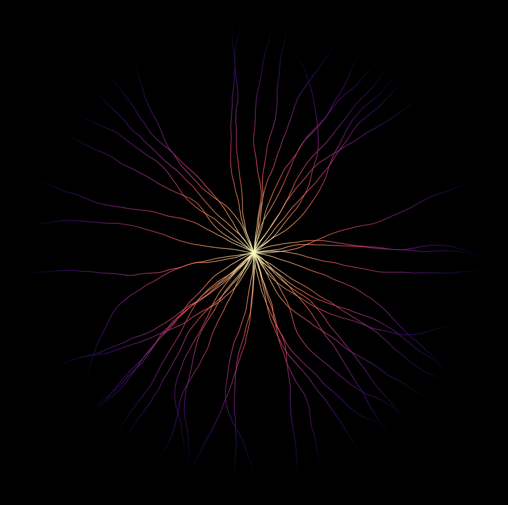

Random walks are a beautifully simple concept that many beginners encounter in
their coding journey. These basic algorithms can be extended to create stunning
visualizations. Below, you'll see how enhancing a simple random walk can result
in a captivating display:







A standard random walk typically restricts movement to four cardinal
directions. However, by allowing the walk to step in any angular direction, we
can create far more dynamic patterns. I first explored this idea during my
master's thesis on simulating the movement of electric fish, and later found
inspiration in a [Reddit
post](https://www.reddit.com/r/generative/comments/r90myk/going_in_circles_angular_random_walk_python_cairo/)
that employed a similar concept.

The real beauty of this approach lies not just in the freedom provided by the
unit circle but also in how we can purposefully limit this freedom. If an agent
were to step in a completely random direction at each juncture, the path would
appear highly chaotic. Typically, "real" agents (whatever they might represent)
move in relatively straight trajectories most of the time.

To achieve more natural movement, rather than selecting a direction at random
each time, we can utilize a probability density function (PDF) to influence the
likelihood of choosing certain directions based on the previous step's
direction. In this example, we'll use a Gaussian PDF, although for simulating
the motions of a Knifefish, I employed a bimodal Gaussian or a von Mises
distribution to mimic the characteristic forward and backward movement of these
fish.

Such configurations ensure that the trajectory of the subsequent step remains
close to the previous step, with variations governed by the standard deviation
of the Gaussian.

Let's jump into the code. First, we need to import some libraries and set up
Matplotlib to use a dark theme.

```python
import numpy as np
import matplotlib.pyplot as plt
import numpy as np
import seaborn as sns
from matplotlib.collections import LineCollection

plt.rcParams.update(
    {
        "figure.facecolor": "black",
        "axes.facecolor": "black",
        "axes.edgecolor": "white",
        "axes.labelcolor": "white",
        "xtick.color": "white",
        "ytick.color": "white",
        "grid.color": "white",
        "text.color": "white",
        "legend.facecolor": "black",
        "legend.edgecolor": "white",
    }
)
```

Now lets declare some parameters. Playing with them will substantially impact
the output of our random walk.

```python
n_walkers = 500
n_steps = 500
starting_point = (0, 0)
```

The `initial_seed` will be the possible trajectories that the first step
of each walker is drawn from.

```python
initial_seeds = np.linspace(0, 2 * np.pi, n_walkers)
```

The `gaussian_pdf_sigmas` will be the standard deviations of the probability
density functions that determine the the variability of the trajectory in the
next step, given the current step.

```python
gaussian_pdf_sigmas = np.linspace(np.pi / 150, np.pi / 100, n_walkers)
```

Let's also select a colormap and introduce a circle, on which the random walkers
start from.

```python
cmap = sns.color_palette("mako", as_cmap=True)
circle_radius = 220  # Adjustable radius for the circle
```

Now let's randomly draw the initial trajectories for each walker as well as
the standard deviation that determines the variability of each walker.

```python
seeds = np.random.choice(initial_seeds, n_walkers)
pdf_sigmas = np.random.choice(gaussian_pdf_sigmas)
```

The following lines set the initial position of each random walker
onto the boundary of a circle that we can control with the `circle_radius`
parameter.

```python
# Compute starting positions on the rim of the circle
start_x = circle_radius * np.cos(seeds)
start_y = circle_radius * np.sin(seeds)

# Initialize positions array to store positions at each step for each walker
positions = np.zeros((n_walkers, n_steps, 2))
positions[:, 0, 0] = start_x
positions[:, 0, 1] = start_y
```

The main loop for the random walk is straightforward but compelling in its
simplicity. We are adjusting the direction slightly using a Gaussian PDF while
updating the walker's position on each step. This could probably be optimized
to run faster, but at this point this is not nessecary and I think this is much
more readable.

```python
# Perform the random walk
for step in range(1, n_steps):
    # Generate directions based on Gaussian distribution
    seeds = np.random.normal(seeds, pdf_sigmas)

    # Calculate step increments
    dx = np.cos(seeds)
    dy = np.sin(seeds)

    # Update positions
    positions[:, step, 0] = positions[:, step - 1, 0] + dx
    positions[:, step, 1] = positions[:, step - 1, 1] + dy
```

For the visualization, we differentiate the paths by their distance from the
origin, adding an aesthetic dimension to the display.

```python
# Plot the paths of the walkers
fig, ax = plt.subplots(figsize=(20, 20))
for i in range(n_walkers):
    # get x and y positions
    x = positions[i, :, 0]
    y = positions[i, :, 1]

    # compute distance to origin at (0,0)
    dist = np.sqrt(x**2 + y**2)

    points = np.array([x, y]).T.reshape(-1, 1, 2)
    segments = np.concatenate([points[:-1], points[1:]], axis=1)

    # Create a continuous norm to map from data points to colors
    norm = plt.Normalize(dist.min(), dist.max())
    lc = LineCollection(segments, cmap=cmap, norm=norm)

    # Set the values used for colormapping
    lc.set_array(dist)
    lc.set_linewidth(1.5)
    lc.set_alpha(1)
    line = ax.add_collection(lc)

ax.axis("equal")
ax.axis("off")
# plt.savefig("cover1.jpg", bbox_inches="tight", pad_inches=0, dpi=300)
plt.show()
```

I hope you find these visual results as fascinating as I do. With further
adaptation, such as integrating principles from the Boids algorithm — which
emphasizes coherence, separation, and alignment — we could guide the walkers
into forming dynamic flocks as they evolve. This concept is something that we
may explore in a future post.
