Recently, I was lucky enough to join [Jan Benda](https://uni-tuebingen.de/fakultaeten/mathematisch-naturwissenschaftliche-fakultaet/fachbereiche/biologie/institute/neurobiologie/lehrbereiche/neuroethologie/) on a research expedition to study the fascinating world of electric fish in the Amazonian Rainforest. 

Over the course of nine days at a remote field station, I encountered the challenges and wonders of this unique ecosystem, all in the pursuit of understanding these enigmatic aquatic creatures.

The following is a small report on my experience.


  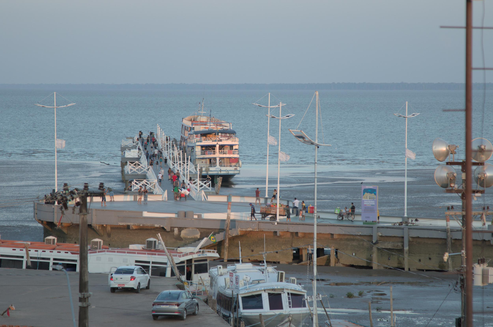
  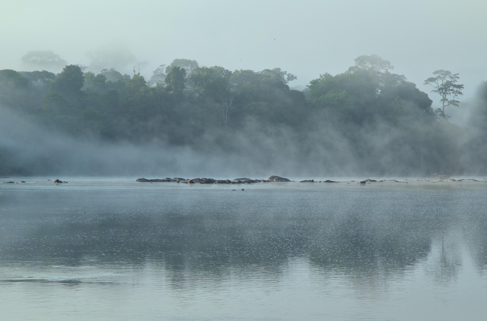
  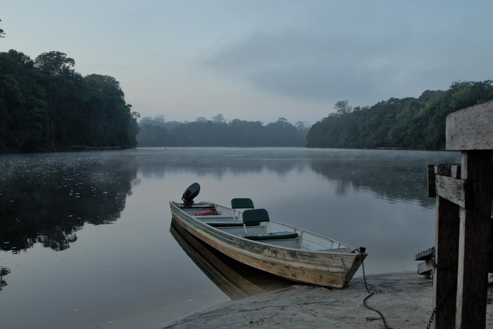
  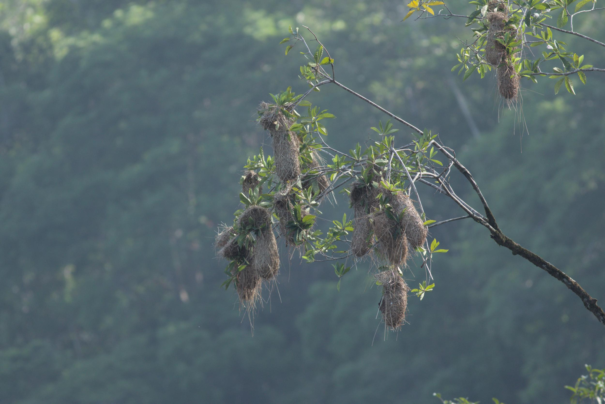
  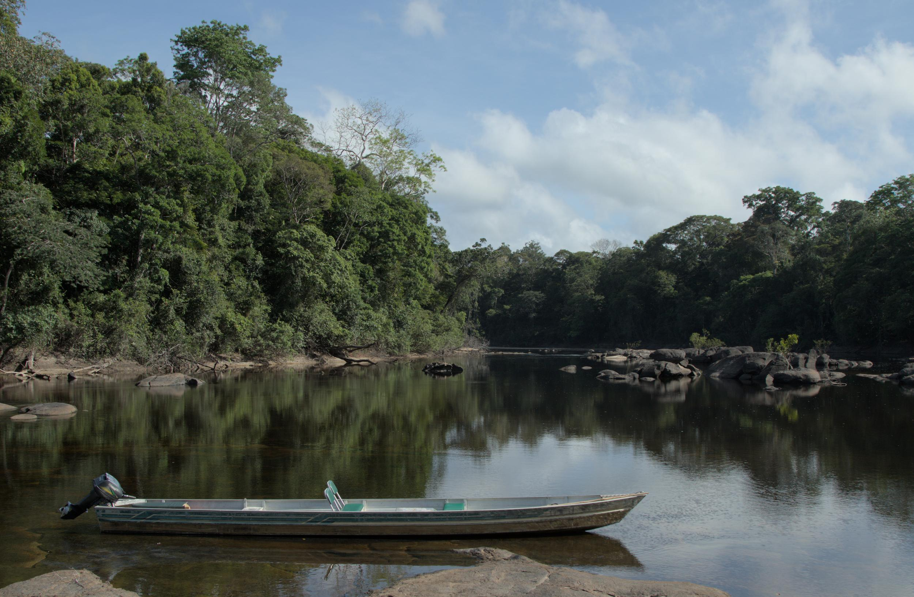
  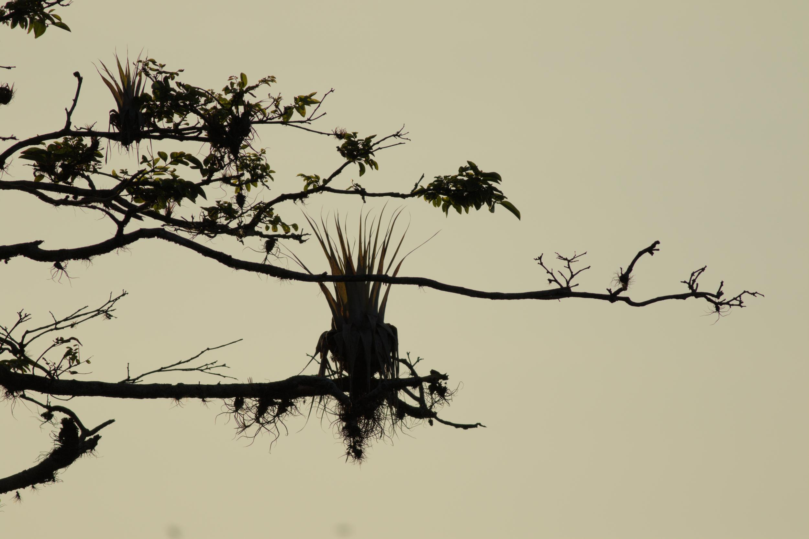


## Why electric fish?

Looking at the Neotropics, electric fish are everywhere. Everybody knows about the electric eel, but there are many more species that are small, nocturnal and rarely obreved without the use of specialized equipment. These, 'just' weakly electric fish use their electric organ to communicate, navigate and hunt in the waters of the Amazonian Rainforest. Yes, they are a very popular model in Neurophysiology, but their ecology, natural behavior and communication are still poorly understood. And that's where we come in.

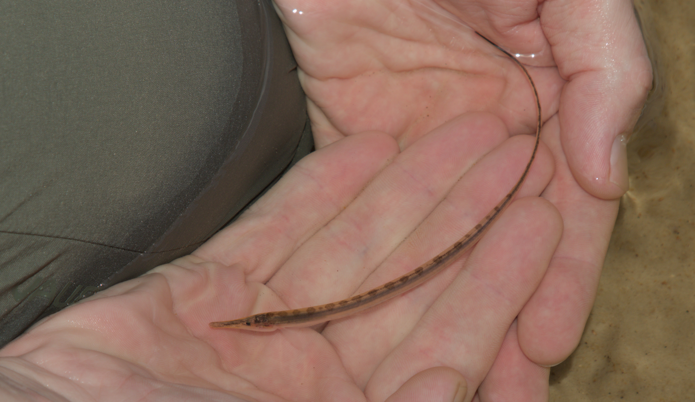

## The research objective

Wave-type electric fish, with more that 100 species, are unique in that the signal they produce is always on. This means that they are constantly emitting an electric field and we can measure this field using electrodes and amplifiers. And since the field of each fish oscillates with a unique frequency, we can even tell them apart. But we want to take this to the next level: Using electrode grids, we can measure the electric field on plane and reconstruct movement, communication and in some species even sex of multiple individuals in their natural habitat. This is not totally new and has been done [before](https://www.jneurosci.org/content/38/24/5456.short) but we want to (1) increase the resolution from previously 64 to 256 electrodes and (2) make the system portable, modular and robust. And on this field trip, we tested the first prototype of this system.

## The field station

To reach the field station, we had to fly from Frankfurt to Lisbon and from there to Belem, a city in the north of Brazil. From there, we took a small plane to Macapa, the capital of the state of Amapa. From there, Christoph Jaster, head of the local park administration, was kind enough to drive us to the city of Porto Grande, where we got to meet our boatsman Junior, who would take us to the field station. And after two hours in the car and another two hours on the river, we finally arrived at the southernmost tip of the FLONA do Amapa, a national park in the Amazonian Rainforest.

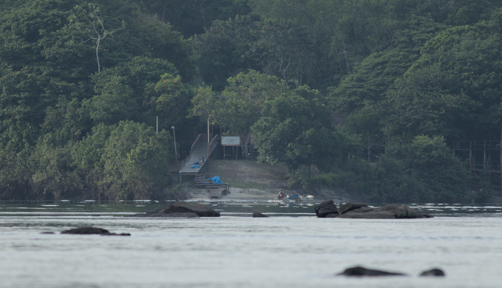

The field station is located on the southernmost tip of the FLONA do Amapa right where the Rio Falsino meets the Rio Araguari. It is a small house equipped with a small kitchen, a bathroom and a place to put up hammocks. For a few hours in the evenings, a generator powers the lamps and there even is satellite internet. But most of the time, we were surrounded by the sounds of the rainforest, the calls of the birds and the howling of the monkeys. 

## Daily life at the field station

The days started early, with the sun rising at around 5:30. After a quick breakfast, we would spend most of the mornings setting up, fixing or debugging our equipment. The afternoons were reserved for field work, where Junior would take us to the river to test our recording hardware. 

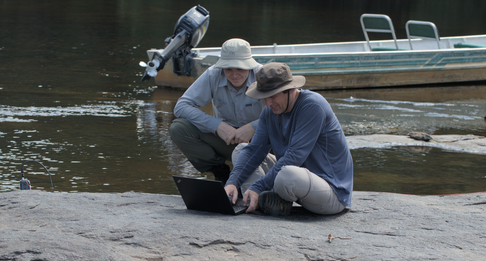

On most days the heat during lunchtime would render us useless, so we would either retreat to our hammocks for sweaty nap or linger around in the 32°C water of the river. This would also give us the opportunity to wash our clothes in the river, which would dry in the sun within a few hours.

On most of the days, we would come back from the river with another problem to solve, so we would spend the evenings fixing and debugging our equipment again. Telma, our cook, would prepare lunch and dinner for us, which was always delicious. And after dinner, we would spend the evenings analyzing data and fixing equipment. Falling asleep in a sweaty hammock, surrounded by the sounds of the rainforest, was always a welcome relief after a long day of work.

## Equipment and data collection

- Fishfinder
- Electrode grid
- Loggers

## Wildlife and biodiversity

As a side effect of working in the rainforest, we got to see a lot of wildlife. We saw lots of birds, including toucans, parrots, macaws, hummingbirds and many more. We also saw lots of insects, interesting moths and butterflies, reptiles and amphibians. 


  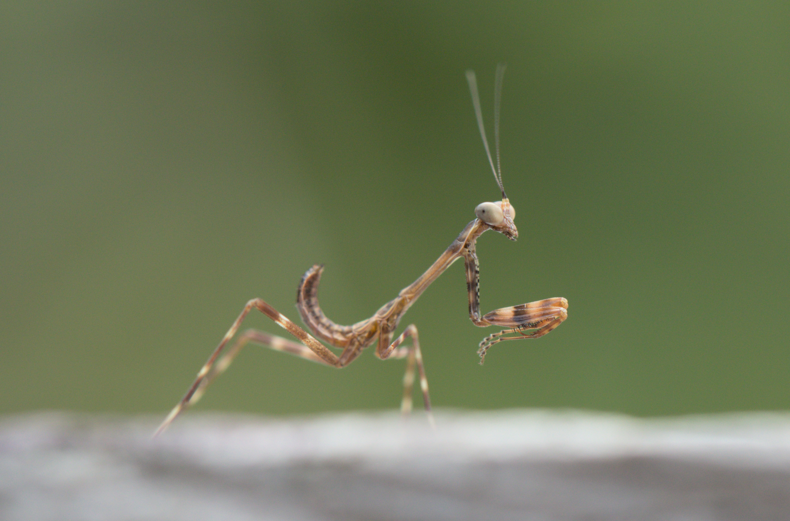
  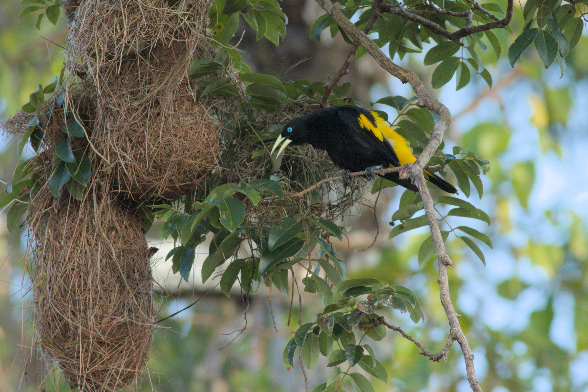
  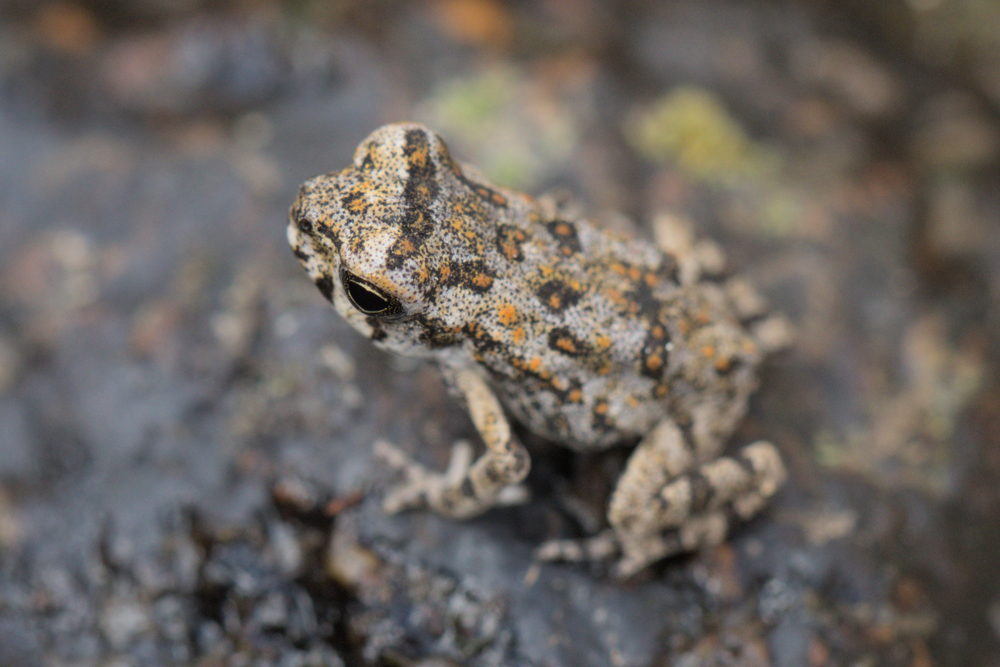
  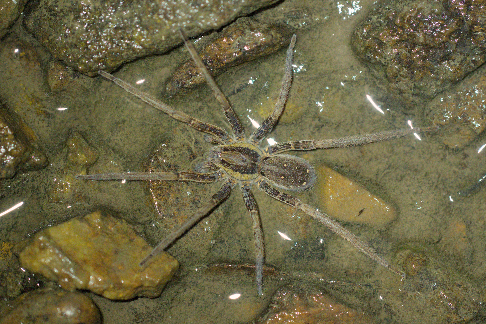
  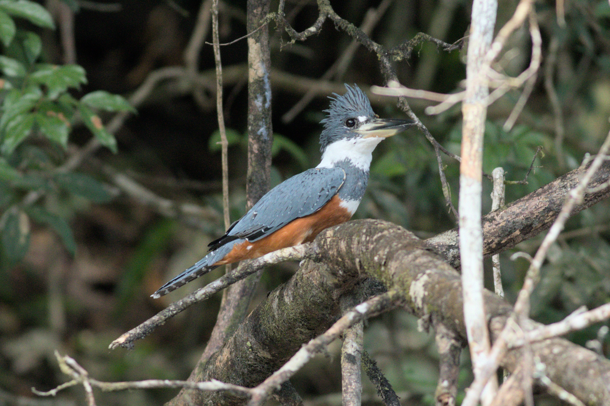
  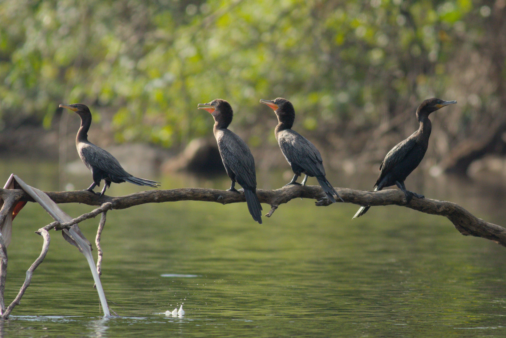


Most of the fish we saw on the other hand, where small catfish, because the electric fish we were after hide in crevices during the day. But we did see a few of them, including a few Eigenmannia at night and an Archolaemus that I managed to video tape with my phone as it was hiding between two stones. This resulted in an amusing photo of me, trying to get a good shot of the fish. 

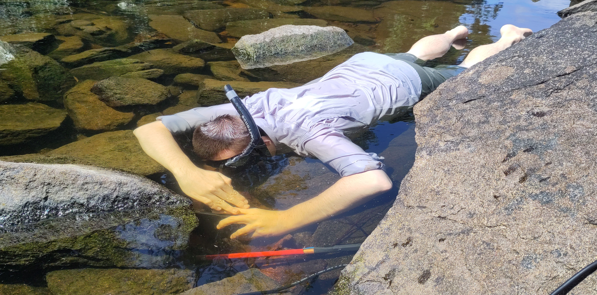

Getting a video made us very happy because of the elusiveness of these fish. Communicating about them whith just data points on a screen is very difficult, so having a video of them is very valuable.



We also got to see a specimen of Gymnorhamphichthys, a pulse-type weakly electric fish that buries itself in the sand on the river banks. Without our electrodes, they would be very difficult to find, but with them, we were able to locate two of them and even record a video of one of them. The noise in the background is the electric organ discharge that is translated into sound by our amplifiers.



But there was one electric fish that seemed to haunt us wherever we went: 
Electrophorus, the electric eel. Our first encounter was on the first day in the field, where we looked for a small side stream of the Rio Falsino. In the mouth of that stream, just as we wanted to step out of the boat, we were greeted by four, about 1.5 long eels calmly laying in the shallow water.

## Challenges and lessons learned

## Data analysis and outlook

## Acknowledgements
