Recently, I had the privilege of joining [Jan
Benda](https://uni-tuebingen.de/fakultaeten/mathematisch-naturwissenschaftliche-fakultaet/fachbereiche/biologie/institute/neurobiologie/lehrbereiche/neuroethologie/)
on a research expedition to dive head first into the realm of electric fish in
the Amazonian Rainforest.

Over the course of nine days at a remote field station, we were immersed in the
challenges and wonders of this unique ecosystem, all in pursuit of unraveling
the mysteries of these aquatic creatures.

## A Pictorial Journey

Let's start with some visuals to set the scene:


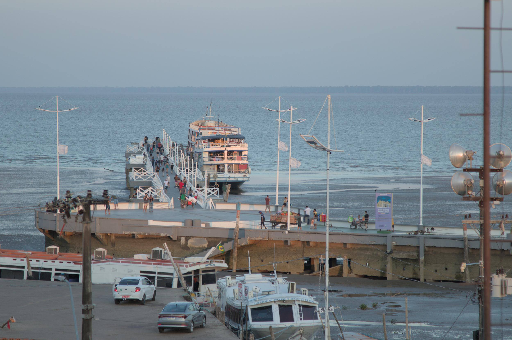
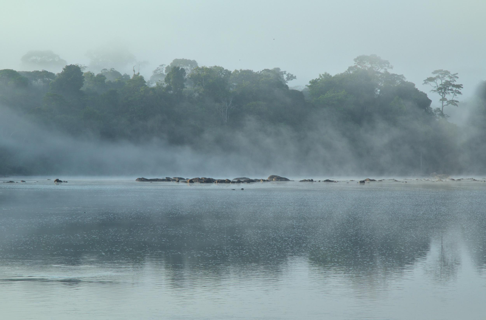
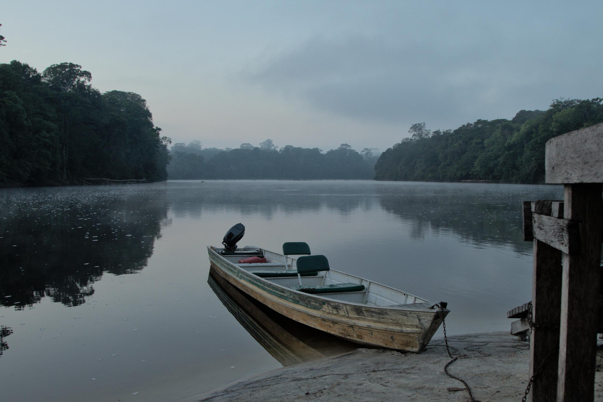
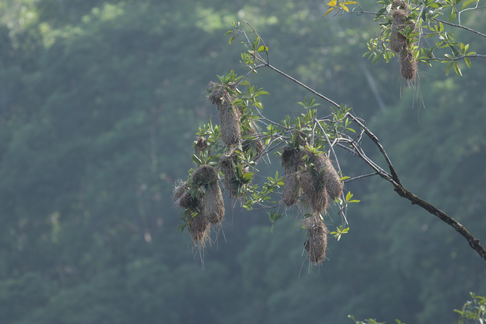
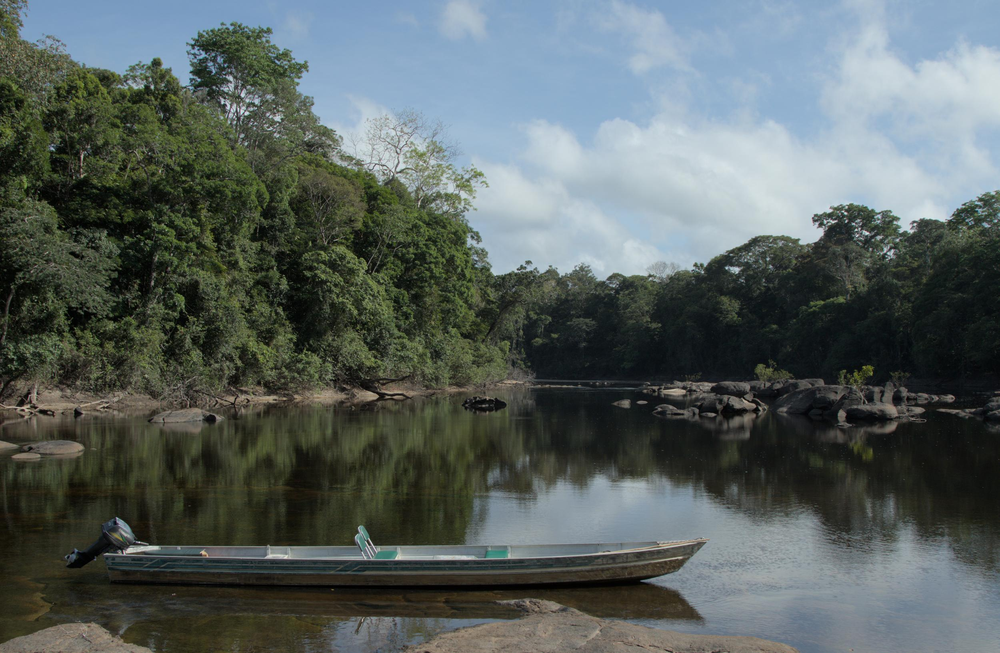
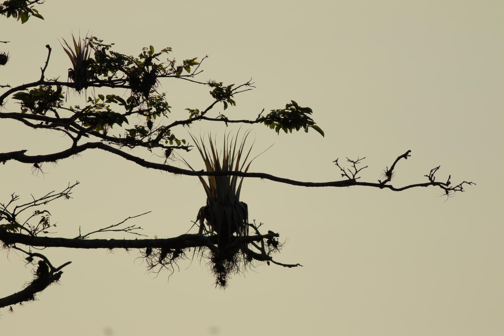



## Why Electric Fish?

In the vast expanse of the Neotropics, electric fish are ubiquitous. While most
people have heard of the electric eel, there are numerous lesser-known species
that are small, nocturnal, and rarely observed without specialized equipment.
These 'weakly' electric fish utilize their electric organs for communication,
navigation, and hunting in the Amazonian Rainforest waters. While they serve as
a popular model in Neurophysiology, their ecological roles, natural behaviors,
and communication methods remain largely enigmatic. This is where our journey
begins.

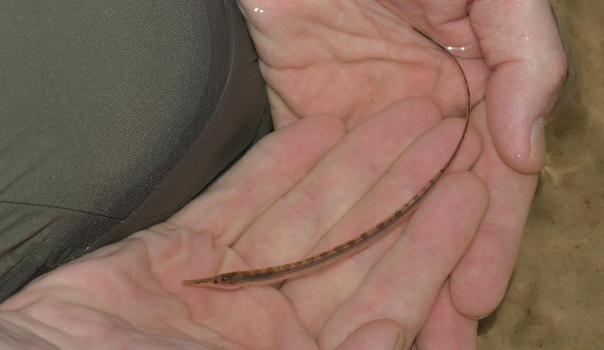

## The Research Objective

Wave-type electric fish, comprising many species, are unique in that they
constantly emit an electric field. We can measure this field using electrodes
and amplifiers. The field of each fish oscillates at a unique frequency,
allowing us to distinguish them. Our aim is to take this a step further:
employing electrode grids to measure the electric field on a plane and
reconstruct the movements, communication, and even the mating behaviors of
multiple individuals in their natural habitat. While similar work has been done
[before](https://www.jneurosci.org/content/38/24/5456.short), we aim to (1)
enhance the resolution from the previous 64 to 256 electrodes and (2) make the
system portable, modular, and robust. During this field trip, we tested the
first prototype of this system.

## The Expedition to the Field Station

Reaching our field station was no easy feat. We embarked on a journey that took
us from Frankfurt to Lisbon and then to Belem, a city in northern Brazil. From
Belem, we hopped on a small plane to Macapa, the capital of the state of Amapa.
From there, we were graciously driven to Porto Grande by Christoph Jaster, head
of the local park administration, where we met our boatsman, Junior, who would
transport us to the field station. After two hours in the car and another two
hours on the river, we arrived at the southernmost tip of the FLONA do Amapa, a
national park nestled within the Amazonian Rainforest.

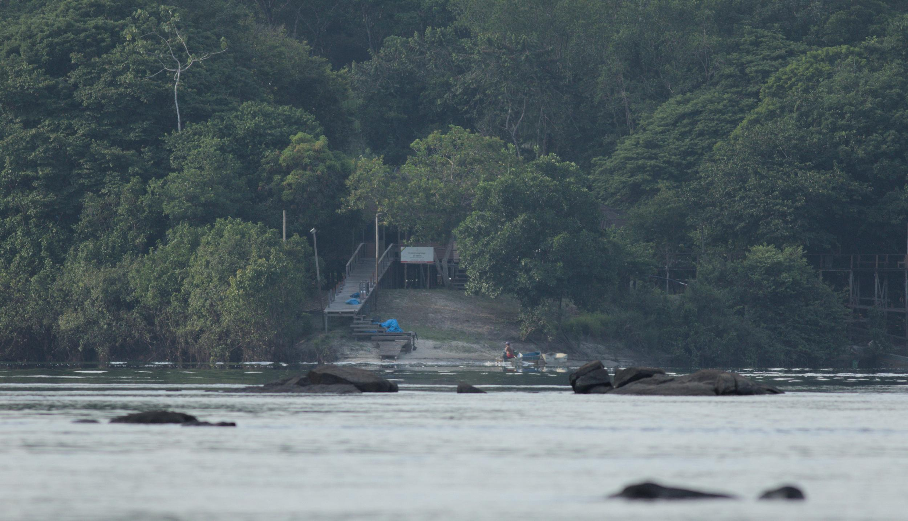

The field station itself, perched at the confluence of the Rio Falsino and the
Rio Araguari, was a humble abode with a small kitchen, bathrooms, and space
for hammocks. In the evenings, a generator powered the lights, and we even had
satellite internet. However, most of the time, we were serenaded by the sounds
of the rainforest, the chirping of birds, and the distant howling of monkeys.

## A Day in the Life at the Field Station

Our days began with the early rising sun at around 6 AM. After a quick
breakfast, the mornings were devoted to setting up, fixing, or debugging our
equipment. In the afternoons, Junior would ferry us to the river for fieldwork,
where we tested our recording hardware.

Navigating the river's shallows and rapids was exhilarating, especially since
our visit coincided with the dry season, causing the water levels to drop
noticeably. Despite the challenges, Junior skillfully guided our boat, and we
never found ourselves stranded or pushing the boat through shallow waters.
Maneuvering through the river's rapids proved to be an enjoyable part of our
daily routine.

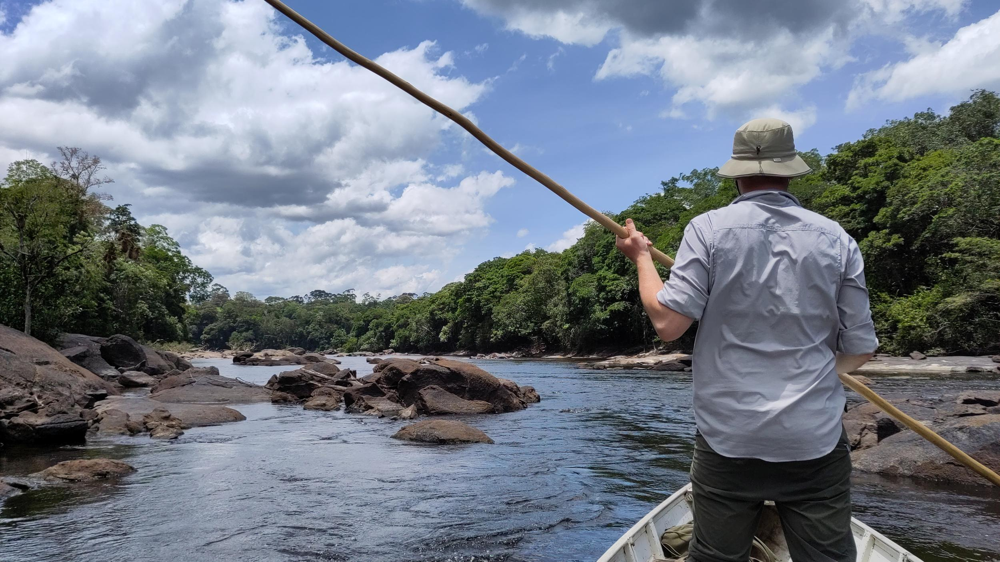

The sweltering midday heat often left us lethargic, prompting us to seek
respite in our hammocks for a brief siesta or to "cool off" in the 32°C river
waters. These moments also offered the opportunity to wash and dry our clothes
in the sun within a few hours.

Most evenings, we returned from the river with new challenges to tackle,
leading us to spend the nights fixing and debugging our equipment. Telma, our
cook, prepared meals for us and provided much-needed relief from
cooking duties. After dinner, our evenings were dedicated to data analysis and
equipment maintenance. Falling asleep in our sweaty hammocks, enveloped by the
sounds of the rainforest, was a welcome reprieve after a long day's work.

## Equipment and Data Collection

Our expedition was equipped with two main categories of hardware:

### Fish Finders

At its simplest, a fish finder can be an audio amplifier. However, instead of
plugging in a guitar or microphone, we connected our electrodes. This allowed
us to audibly detect the electric organ discharges of the fish. While mere
audio signals sufficed for locating the fish, Jan is in the process of
developing a [Smart Fish Finder](https://github.com/janscience/fishfinder) with
a screen capable of plotting fish waveforms. This advancement will enable us to
discern the genus of the fish without visual confirmation.

### Recording Hardware

Once we identified promising recording locations, we deployed our logging
devices. Our goal is to create a platform of affordable, waterproof loggers
constructed from readily available components. The most exciting aspect? These
loggers are modular and adaptable for various recording purposes:

#### Logger Configuration

Each logger consists of a microcontroller, a battery, an SD card, and
currently, a temperature sensor. It can receive input from up to 16 electrodes,
with recording duration limited only by the SD card's capacity and battery
life. In theory, they could record data for months, and deploying a network of
loggers over a large area could capture migratory patterns of fish. This is the
configuration we tested the most on during our field trip.

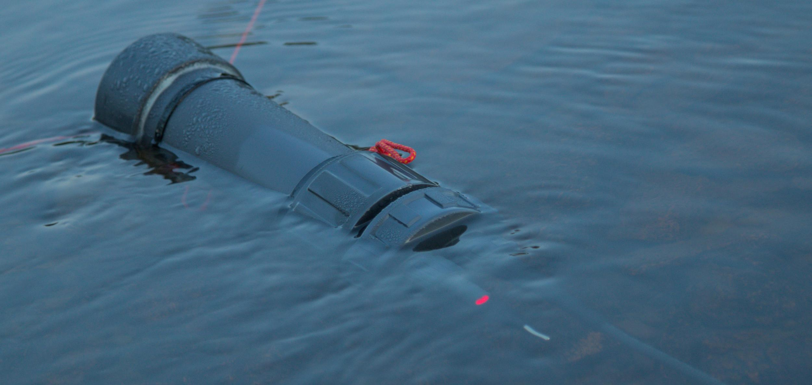

#### Grid Configuration

Our plan is to employ these same loggers, with the addition of a cable for
power, arranged side by side to form an electrode grid. With 16 electrodes, the
placement of 16 loggers would result in a 256-electrode grid. This setup would
enable us to record the electric field on a plane, facilitating the
reconstruction of interactions and communication among multiple individuals.
However, after five days of rigorous testing and debugging, we discovered that
the current circuit boards introduced interference when devices were placed
closely together. Thus, we will need to redesign and retest the circuit boards
in the future.

## Wildlife and Biodiversity

In addition to our electric fish research, our time in the rainforest afforded
us the opportunity to observe a myriad of wildlife. We encountered a variety of
avian species, including toucans, parrots, macaws, hummingbirds, and more. Our
journey also brought us in contact with numerous insects, captivating moths and
butterflies, reptiles, and amphibians.


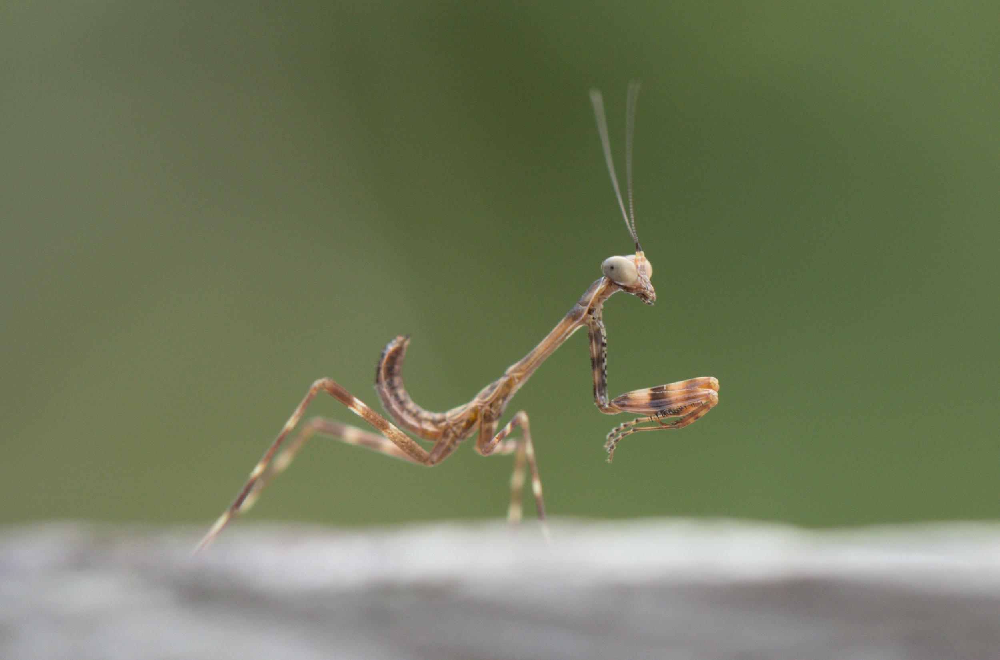
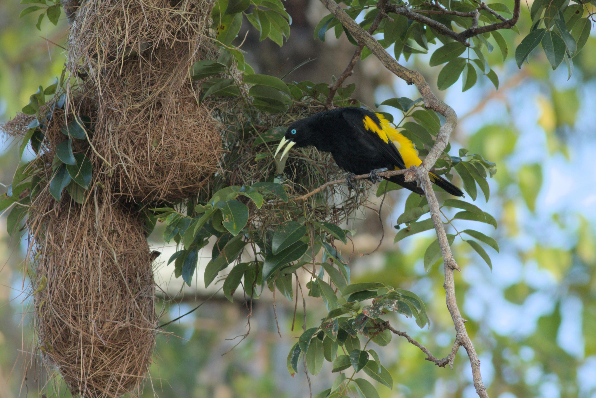
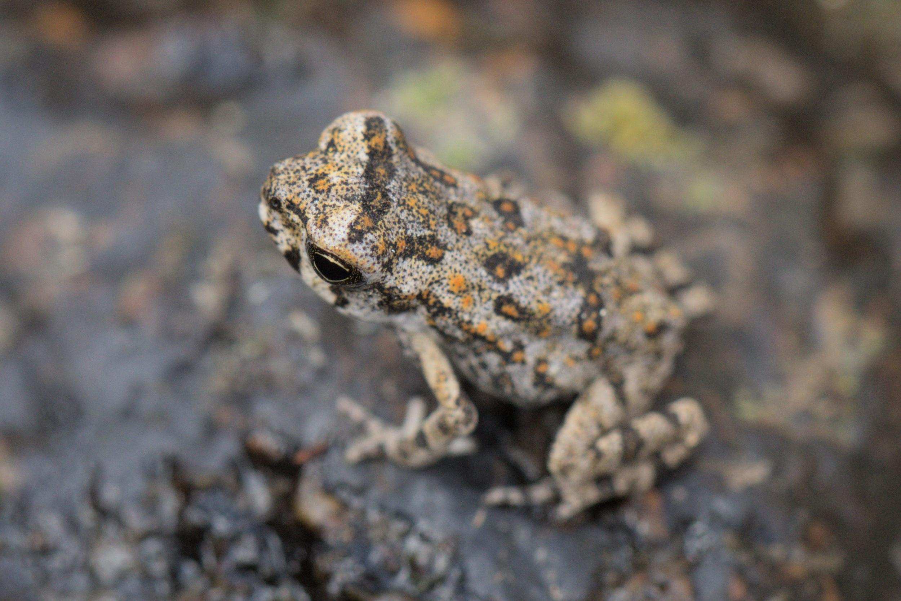

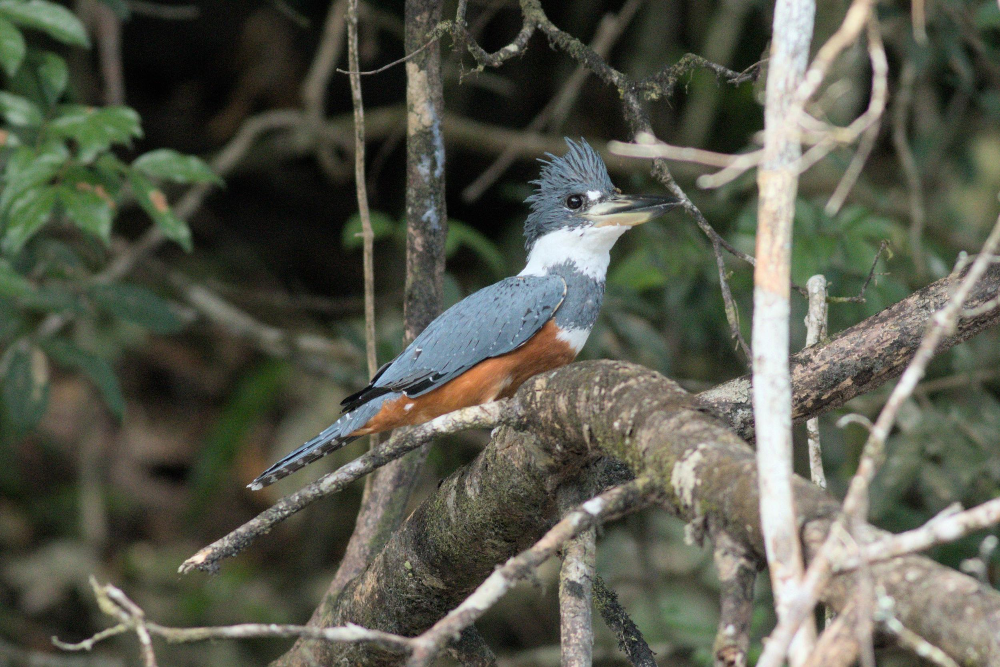



Most of the fish we encountered were small catfish, as the electric fish we
sought tend to hide in crevices during the day. Nevertheless, we did have a few
remarkable encounters, including Eigenmannia at night and an Archolaemus, which
I managed to capture on video with my phone as it nestled between two rocks.
This endeavor resulted in an amusing photo of me attempting to capture a good
shot of the fish.

Obtaining a video was a source of great joy, given the elusive nature of these
fish. Communicating about them using only data points on a screen can be
challenging, so having a video was invaluable.



We also encountered a specimen of Gymnorhamphichthys, a pulse-type weakly
electric fish that buries itself in the sand on riverbanks. Without our
electrodes, locating them would have been exceedingly difficult, but with their
help, we pinpointed two of them and even recorded a video of one. The
background noise you hear is the electric organ discharge, which our amplifiers
convert into sound.



However, one electric fish appeared to shadow us wherever we ventured:
Electrophorus, the electric eel. On our first day in the field, as we explored
a small tributary of the Rio Falsino, we encountered four eels, each about 1.5
meters in length, serenely lounging in shallow water.

In the ensuing days, similar scenes greeted us each time we approached areas
where smaller streams met the main channel. We also detected them (not
visually, but via our fish finders) while working in the middle of the river.
Picture standing chest-deep in the middle of a river, immersed in your work,
and suddenly hearing the distinct 'toc, toc, toc' of an approaching electric
eel. When we heard them on the amplifiers, we knew they were just meters away,
prompting us to swiftly exit the water and wait for them to pass. We also
learned that they frequently traversed the swimming area at the station, as we
had recorded them there before. Over time, we stopped carrying the fish finders
when we wanted to relax and cool off, leaving the door open for future
underwater encounters.



I must confess that I had underestimated these creatures. I once naively
assumed them to be 'simple,' solitary hunters that relied on their electric
organ to stun prey. However, as we were fortunate to observe, they are highly
social animals, with documented instances of group hunting. I am eager to see
what we can uncover about them in the future.

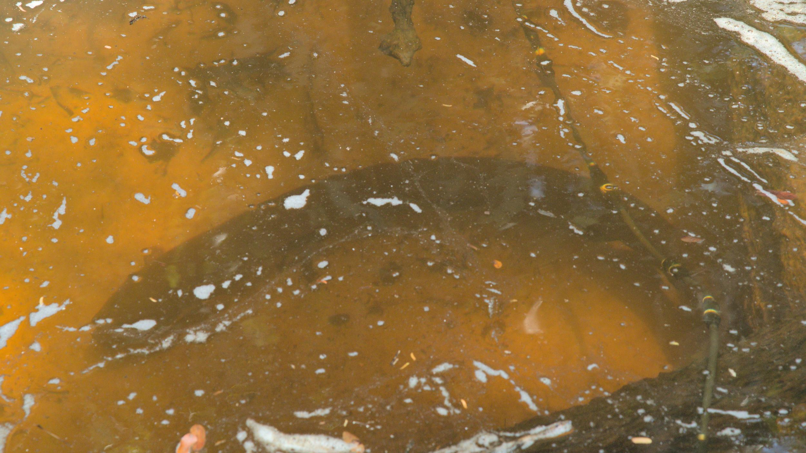

## Challenges and Lessons Learned

Our expedition was not without its share of challenges, some expected and
others not. Yet, we garnered valuable lessons and insights from them, fueling
our enthusiasm to return to the field and test our new equipment.

The most significant lesson we took away was that no matter how extensively you
test your equipment in the lab, field conditions will inevitably present new
issues. Paradoxically, these challenges are opportunities to enhance the
robustness of your equipment. Hence, this field trip was indispensable, as it
exposed problems we would not have encountered in a controlled environment. We
are elated to have embarked on this journey and eager to return.

## Data Analysis and the Road Ahead

Currently, we are just starting analyzing the data we gathered during this
expedition. Our exploration is just beginning, and we are thrilled about the
potential discoveries that await us. We will keep you updated on our progress.
In the meantime, here are some preliminary findings:

The first figure displays the pulse waveform of one of the Gymnorhamphichthys
we recorded. The top panel shows the electric organ discharge recording, while
the bottom panel illustrates the waveform of the pulses.

The second figure showcases a recording from one of our loggers, revealing at
least four individuals, with three in the lower frequency range, potentially
Sternopygi. The fourth individual operates in the higher frequency range.

## Acknowledgements

First and foremost, I would like to express my deepest gratitude to **Jan
Benda** for extending the invitation to join him on this remarkable field trip.
It was an invaluable opportunity to work with him and learn from his expertise.

This field trip would not have been possible without the generous assistance of
many individuals. The logistical challenges of such an expedition were more
significant than we anticipated, and we are incredibly thankful for the support
we received.

- **David de Santana** played a pivotal role in connecting us with **Christoph
  Jaster**. Without this connection, we would have remained unaware of the
  existence of the FLONA do Amapa field station. We are sincerely appreciative of
  his contribution.

- **Christoph Jaster** diligently managed the permits and logistics from Macapa
  to the field station. His assistance was indispensable, particularly when our
  equipment was lost in transit. Furthermore, his kindness was evident when he
  drove us to the airport at 1 AM when our departure was imminent.

- Our heartfelt thanks go to **Telma**, our cook at the field station. Her
  delicious meals and unwavering kindness were a tremendous relief, sparing us
  the task of preparing our own food. We are deeply grateful for her support.

- **Junior** proved to be an exceptional boatsman. Communicating through
  gestures, a few words, and Google Translate, we not only enjoyed our time with
  him but also spent a memorable night under the stars in our hammocks along the
  Araguari River bank. We hope to have the privilege of working with him again in

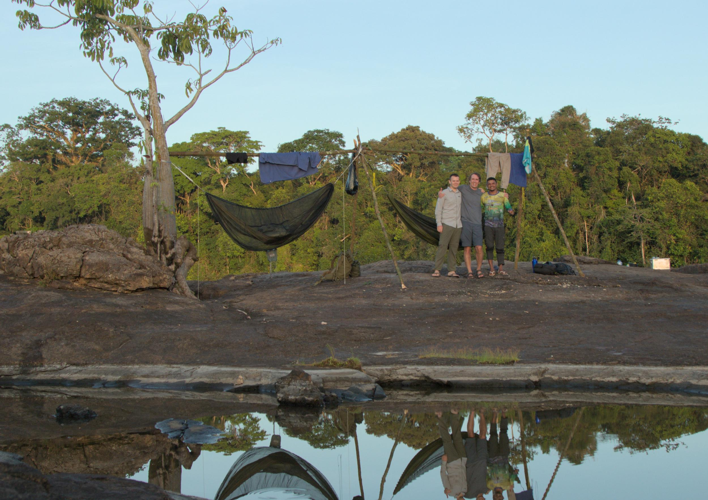
