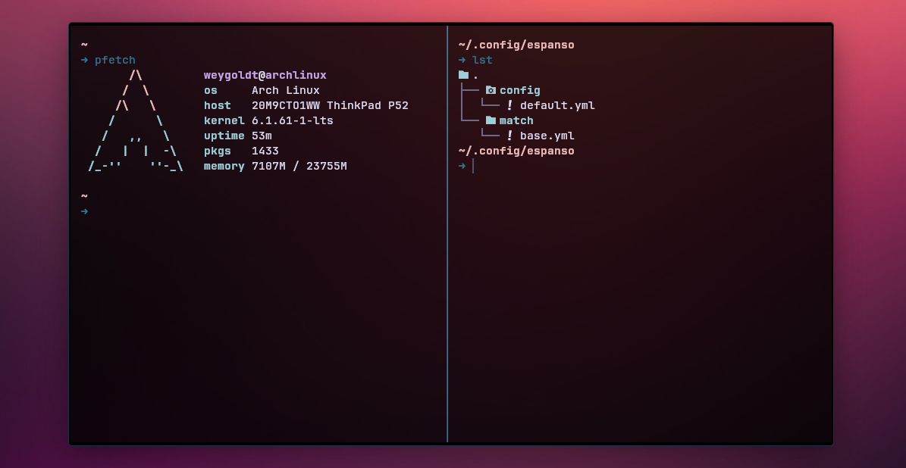

The Python ecosystem is huge and it is growing every day. It is hard to keep up with all the new libraries and tools. In this post I will share my tech stack for data science in 2023. I will update this post every year to document my plunge into this never ending rabbit hole.

Disclaimer: Everything below is my opinion. If I get something wrong, please let me know. I don't use all of these tools in every project and I don't list all tools that I use here. I am merely providing a list of tools that I particularly enjoy using and that I think are worth checking out as I am writing this post.

## Why Python?

Pythion is a general purpose programming language that is used for a wide variety of applications. It is a great language for data science because it is easy to learn, has a huge ecosystem of libraries and tools and it is free and open source. And beyond data science, it can be used for almost anything else.

## Terminal and shell

The terminal is where I spend half of my working day. Ideally, it should be fast, functional and pretty. And most importantly, it should be simple. For this reason, I switched from Alacritty to Kitty:

- [Kitty](https://sw.kovidgoyal.net/kitty/) - Kitty is a fast, featureful, GPU based terminal emulator. It is fast, has great support for unicode and is highly customizable. It is my go to terminal emulator. It is also cross platform and works on Windows, Linux and macOS. Compared to Alacritty, it requires a minimal amount of configuration and is easy to set up. It comes with sane keybindings out of the box and even has build-in support for ligatures, emojis, images and even tiling! No need to configure tmux.

The same goes for the shell:

- [Zsh](https://www.zsh.org/) - As opposed to Bash, Zsh is a shell designed for interactive use. It is a great shell with a huge ecosystem of plugins and themes. I use it with [starship](https://starship.rs/) as a prompt and vim keybindings. This way I always now where I am, which environment I am in and what git branch I am on.

## Text editor

The text editor is where I spend the other half of my working day. After trying a lot of different editors, I have settled on two editors that I use for different purposes:

- [Visual Studio Code](https://code.visualstudio.com/) - Visual Studio Code is a free code editor made by Microsoft for Windows, Linux and macOS. It is a bit slow but a breeze to set up and configure and settings sync between devices. It has a huge ecosystem of extensions and is my go to editor for almost everything. Because it is made by Microsoft, it integrates perfectly with GitHub Copilot, a GPT-4 powered AI that helps to make repetitive tasks easier. It is a great tool for writing code.

- [Neovim](https://neovim.io/) - Neovim is a fork of Vim aiming to improve user experience and plugins. It is a bit harder to set up and configure but it is blazing fast and has a huge ecosystem of plugins. I use it for quick edits and for editing files on remote servers. I used it exclusively for a while but eventually broke my config during a time when I was too busy to fix it.

Now that we can write code, we need to set up a virtual environment to run it. In my opinion, virtual environments are a must for any Python project. They allow you to create isolated environments for each project and make sure that the correct versions of your dependencies are installed. This is especially important for data science projects because they often require specific versions of Python and its dependencies. It also prevents your system from getting cluttered with dependencies that you don't need. And since the environment can be frozen and shared with others, it makes your project reproducible.

## Manging a Python environment

Let's say your system uses Python 3.9 but the package you want to use requires Python 3.11. This is where pyenv comes in:

- [Pyenv](https://github.com/pyenv/pyenv) - Pyenv lets you easily switch between multiple versions of Python, just like Anaconda but without Anaconda! It is a great tool for managing Python versions and virtual environments. For smaller projects, `pyenv-virtualenv` is a great tool that lets you create virtual environments that are all stored in one place. For larger projects, I prefer pythons build in `venv` module.

If you have used Pythons build-in venv module, you know that it is a bit of a hassle to always `source .venv/bin/activate`. This is where direnv comes in:

- [Direnv](https://direnv.net/) - Direnv is an environment switcher for the shell. It knows how to hook into bash, zsh, etc. to load or unload environment variables depending on the current directory. This is a great tool for managing environment variables and secrets. I use it to automatically activate and deactivate virtual environments. Pyenv can do this out of the box but only for pyenv virtual environments. Direnv can do this for any virtual environment.

Now that we have an environment, we can start setting up a project.

## Managing a Python project

Version control is **integral** to any software project. It allows you to keep track of changes to your code and makes it easy to collaborate with others. This is where git and GitHub come in:

- [Git](https://git-scm.com/) - Git is a free and open source distributed version control system designed to handle everything from small to very large projects with speed and efficiency. It is the de facto standard for version control and is a must for any software project.

- [Github](https://github.com) - GitHub is a code hosting platform for version control and collaboration. It lets you and others work together on projects from anywhere.

Now that we set up a git repository, we can install a pre-commit hook, that runs every time we push changes to the remote repository:

- [Pre-commit](https://pre-commit.com/) - Pre-commit is a framework for managing and maintaining pre-commit hooks. Pre-commit hooks are scripts that run before a commit is made. They can be used to check for formatting, linting, security issues, etc. I use it to check for formatting, linting and security issues. It is a great tool for maintaining code quality: If a pre-commit hook fails, the commit is aborted and the error is shown to the developer so that it can be fixed. This keeps remote repositories clean and makes sure that all code is formatted, linted and secure. The next tool is a great addition to pre-commit:

### Keeping the code clean

- [Black](https://github.com/psf/black) - Black is the uncompromising Python code formatter. It is a great tool for keeping code clean and consistent.
- [isort](https://github.com/isort) - A tool to sort package imports consistently.
- [ruff](https://github.com/ruff) - The fastest python formatter that also sorts imports, this is my current go-to tool.
- [Pylint](https://www.pylint.org/) - Pylint is a tool that checks for errors in Python code, tries to enforce a coding standard.
- [Pytest](https://docs.pytest.org/) - The pytest framework makes it easy to write small tests, yet scales to support complex functional testing for applications and libraries.

If you build a Python package, the next one is particularly useful:

- [Poetry](https://python-poetry.org/) - Poetry is a tool for dependency management and packaging in Python. It allows you to declare the libraries your project depends on and it will manage (install/update) them for you. It is a great tool for managing dependencies and packaging because it locks versions of your depencencies to their exact commit hash. Combined with the correct Python version and virtual environment, this makes your project reproducible, which is a must, particularly for data science projects.

## Data science libraries

Now that we have set up a project, we can start writing code. The following libraries are the ones that I use most often to analyze data, train machine learning models and visualize results:

- [Numpy](https://numpy.org/) - NumPy is the fundamental package for scientific computing in Python. It is a great library for working with arrays and matrices. It is the foundation of the scientific Python ecosystem and is used by almost every other library.

- [Pandas](https://pandas.pydata.org/) - Pandas is a fast, powerful, flexible and easy to use open source data analysis and manipulation tool, built on top of the Python programming language. It is a great library for working with tabular data.

- [Scipy](https://www.scipy.org/) - SciPy is a Python-based ecosystem of open-source software for mathematics, science, and engineering. It is a great library for scientific computing and includes algorithms for optimization, linear algebra, integration, interpolation, special functions, FFT, signal and image processing, ODE solvers and many more.

- [Matplotlib](https://matplotlib.org/) - Matplotlib is a comprehensive library for creating static, animated, and interactive visualizations in Python. It is a great library for data visualization. It provides fine grained control over every aspect of a figure and is highly customizable.

- [Pydantic](https://pydantic-docs.helpmanual.io/) - Pydantic is a library for data validation and settings management based on Python type hints. It is a great library for validating data and settings. I use it to create data models for my data science projects.

- [Rich](https://github.com/Textualize/rich) - Rich is a Python library for rich text and beautiful formatting in the terminal. It is a much nicer way to display logs, data and progress bars compared to e.g. `tqdm`. It is also the progress bar that `pip` uses when you install something.

## Machine learning tools

- [Scikit-learn](https://scikit-learn.org/) - Scikit-learn is a free software machine learning library for the Python programming language. It features various classification, regression and clustering algorithms including support vector machines, random forests, gradient boosting, k-means and DBSCAN. It is a great library for machine learning.

- [Pytorch](https://pytorch.org/) - PyTorch is an open source library for deep learning and GPU accelerated computing. It is pain-free to install compared to TensorFlow and has a great API.

- [Tensorflow](https://github.com/tensorflow) - Another deep learning framework that comes with Keras, a high level API that makes the usage of pretrained models as well as the creation of coustom models very fast.

The following set of packages are training frameworks, that mostly build on top of pytorch to abstract a lot of the boiler plate code and make model training and evalutation easier.

- [FastAI](https://www.fast.ai/) - The library is a bit dated but the website provides amazing courses on deep learning.
- [Keras](https://keras.io) - A high level API that works with Tensorflow, Pytorch and JAX.
- [Pytorch Lightning](https://lightning.ai/) - This is framework to make pytorch models as easy as fitting sklearn models.
- [SuperGradients](https://www.supergradients.com/) - The new kid on the block by DECI-AI. Home of the current state of the art object detection model YOLO-NAS.

If a project gets bigger and other people start using it, the following tools are great for documentation:

## Documenting and sharing

- [Jupyter](https://jupyter.org/) - Jupyter is a free, open-source, interactive web tool known as a computational notebook, which researchers can use to combine software code, computational output, explanatory text and multimedia resources in a single document. Still, I try to avoid coding in Jupyter notebooks as much as possible but it is a great tool for sharing and documenting exploratory data analysis.

- [Mkdocs](https://www.mkdocs.org/) - MkDocs is a fast, simple and downright gorgeous static site generator that's geared towards building project documentation. Documentation source files are written in Markdown, and configured with a single YAML configuration file. MkDocs builds completely static HTML sites that you can host on GitHub pages, Amazon S3, or anywhere else you choose.

- [Pdoc](https://pdoc.dev/) - Like `mkdocs`, `pdoc` is a documentation generator for Python modules. Unlike `mkdocs`, it is specifically designed to be used with `docstrings` in Python code: `pdoc` automatically generates
  documentation from type annotations and docstrings. It is also much faster than `mkdocs` and is best used for API documentation.

## Reporting

- [LaTeX](https://www.latex-project.org/) - LaTeX is a typesetting system that includes features designed for the production of technical and scientific documentation. It is my favourite tool for writing reports, posters and presentations. It is a bit hard to learn but once you get the hang of it, it is a breeze to use. And the best part is that it is all in plain text so it works great with version control.

## Conclusion

As this is the first version of this post, It does include some tools that are obvious choices for data science in python. But I still think they are worth mentioning because they are so foundational. As I update this post every year, I will remove tools that are no longer relevant and add new tools that I think are worth checking out. If you have any suggestions, please let me know.
