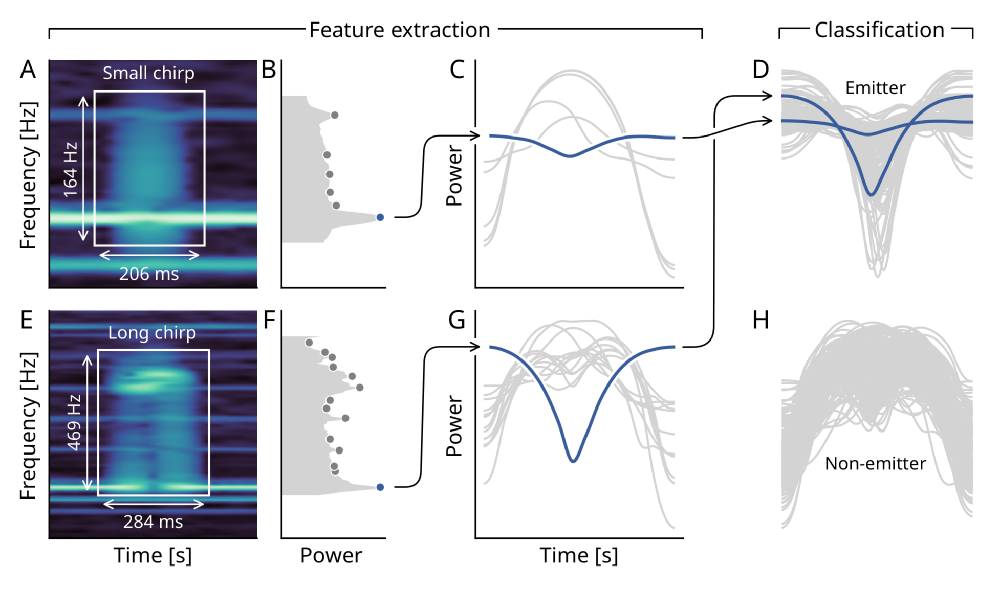

One of my favourite activities when working with data is to **visualize** it. I enjoy
creating plots, diagrams, and rendering videos to communicate complex information in a
simple and appealing way.

## Standalone plots

Here you see some of my data visualizations exclusively rendered in `matplotlib` without
additional edits from graphical editors. Most of them are from my Masters Thesis.



<!--  -->



## Conference posters

The following list includes some posters from University projects as well as
conference presentations. All posters are exclusively rendered in LaTex.

<table>
    <thead>
        <tr>
            <th>Title</th>
            <th>Presented</th>
            <th>Link</th>
        </tr>
    </thead>
    <tbody>
         <tr>
            <td>Complex frequency modulations in freely interacting electric fish recorded in their natural habitat</td>
            <td>International Conference of Neuroethology (ICN), Lisbon 2022</td>
            <td><a target="_blank" href="https://drive.proton.me/urls/83Z66SEED8#k3f6q9ieFiWZ">pdf</a> <a target="_blank" href="https://github.com/weygoldt/synchronous-modulations">github</a></td>
        </tr>
         <tr>
            <td>Automated detection of chirps in electric fish: Deep learning applied to ethology</td>
            <td>Annual Meeting of the Ethological Society, Muenster 2024 & International Conference of Neuroethology (ICN), Berlin 2024</td>
            <td><a target="_blank" href="https://drive.proton.me/urls/7SYFEYJM08#A2LugREOIEkR">pdf</a></td>
        </tr>
    </tbody>
</table>

## Data videos

These were created by producing series of individual frames with Matplotlib
and combining them into videos with ffmpeg.


