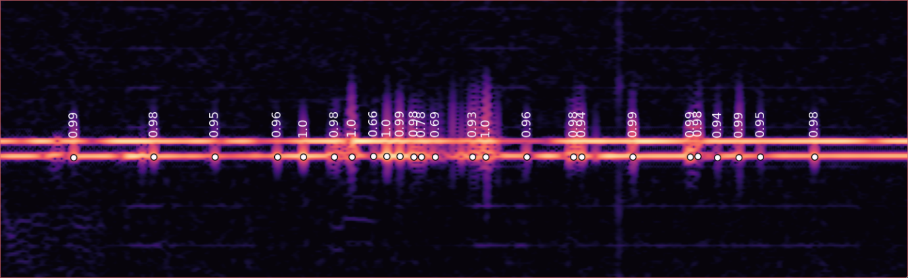
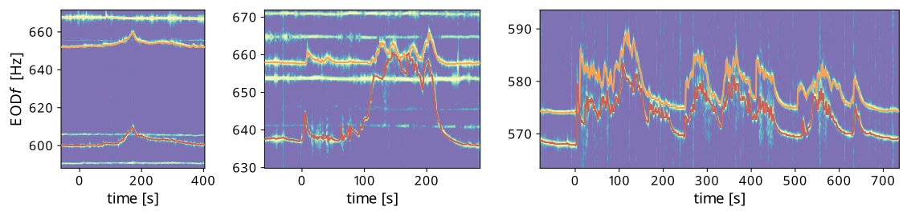
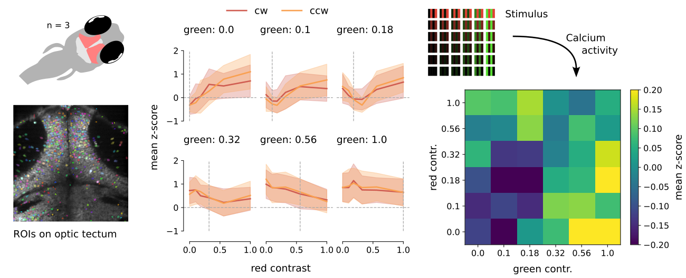
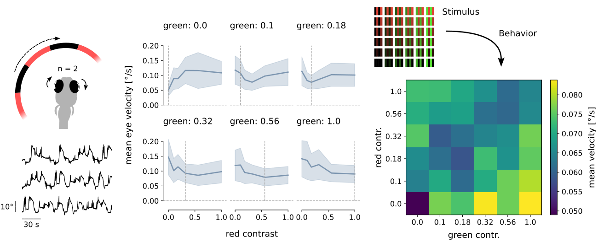

This is a small collection of university and research projects I particularly enjoyed working on. I hope you find them interesting!

 

## Detecting communication signals of weakly electric fish

Understanding the significance of specific communication cues necessitates our ability to detect them, particularly with transient frequency modulation signals like chirps produced by an electric organ discharge in fish. Previous research has mainly focused on immobilizing or artificially stimulating fish or physically separating them, conditions unfavorable for natural communication.

To address this challenge, I designed a convolutional neural network-based detector capable of detecting chirps in freely behaving fish. Despite initially training the model on simulated data, it surprisingly performed well on real-world recordings after some fine-tuning. Using this version, I successfully detected approximately 50,000 chirps, marking the largest dataset at that time.

The following image illustrates a short segment of a recording featuring two fish. Chirps are visible as frequency fluctuations from the baseline of one of the two fish on a spectrogram. The dots indicate where the detector identified a chirp.

Performing preliminary analyses utilizing this detector, we discovered that chirps could potentially be utilized by the losing fish to indicate submission during competition for a shelter among two fish. I am currently working on refining the resulting dataset through manual annotation and correction to train a deep neural network-based detector, specifically designed for detection tasks and optimized to enhance performance on intricate recordings.



 

## Singing in the dark: Synchronous frequency modulations of weakly electric fish

While analyzing a two-week continuous recording of electric fish in their natural habitat, I observed synchronous frequency modulations on a scale of seconds to two ten minutes between two fish. To detect these modulations, I developed a covariance-based detector, which I then used to analyze the recordings. The following plot shows some examples of detected modulations:

By analyzing the estimated positions of fish over time, I demonstrated that those involved in these interactions approach one another following the initiation of their "choir." I also created videos depicting some of these diadic interactions, showing the fish moving as data points on an electrode grid and their frequencies changing on the right-hand side.



The resulting output from this effort was displayed as a poster at the 2022 International Conference of Neuroethology (ICN). This poster can be accessed through the link provided in the GitHub repository below.



 

## Colorblind direction cells in the zebrafish optic tectum

Experimental research has shown that zebrafish are less likely to perceive motion when the only moving element is color. Instead, it is the differences in brightness between moving stimuli that trigger a response (Orger and Baier, 2005). As part of a lab rotation project, we investigated how this behavior manifests in the optic tectum, the primary visual processing center in fish.

To achieve this, we employed two-photon calcium imaging to record the activity of direction selective neurons in the optic tectum of zebrafish larvae. Additionally, we simultaneously measured the optokinetic response, a behavioral indicator of motion perception. 

The ensuing graphs illustrate a comparable pattern between the calcium activities (neural signal) and eye velocities (behavioral output) for the same stimulation conditions.

Our analysis suggested that the direction selective neurons in the optic tectum are likely colorblind, as they primarily respond to variations in brightness rather than color distinctions. As a result of this experiment, we have produced not only a poster but also a more comprehensive report, both of which can be found in the github repository provided below.



 
